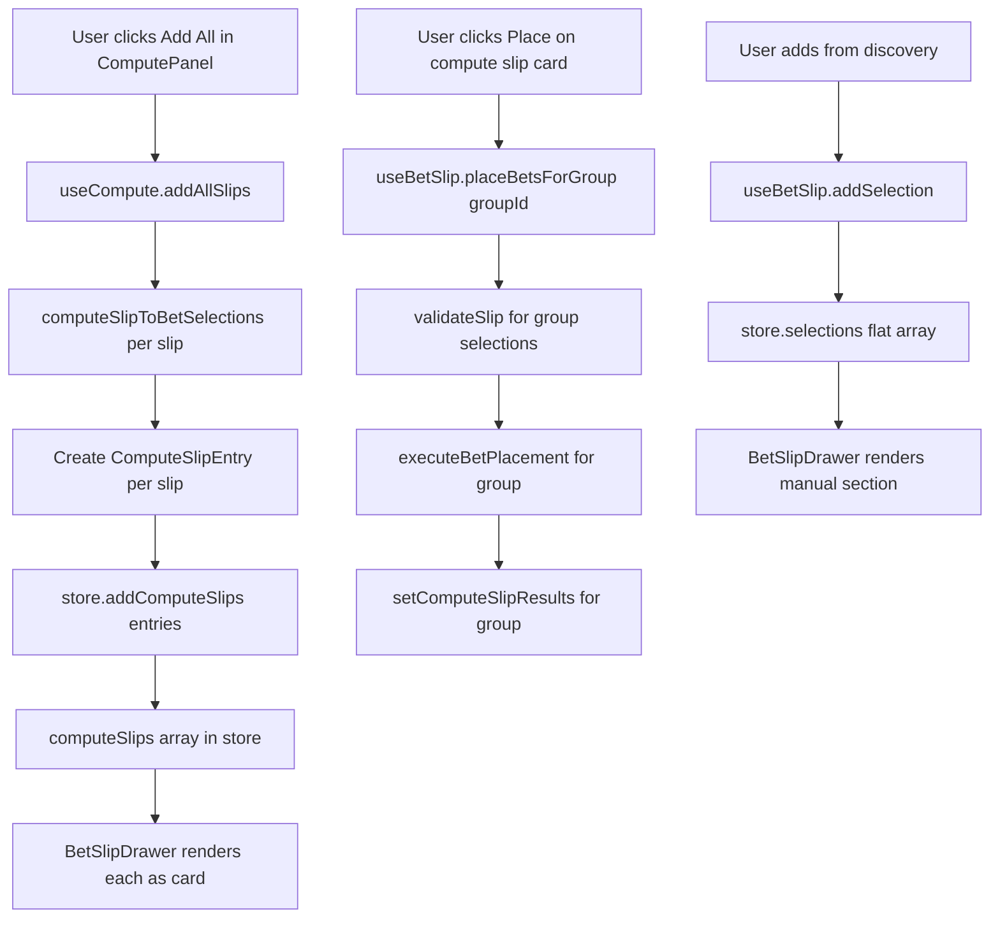

# Bet Slip Isolation Plan

## Problem

When compute adds multiple slips via "Add All" or "Add Selected", all selections merge into one flat `selections: BetSelection[]` array. The drawer renders them as a single combined slip — the user cannot view or place individual compute slips separately.

**Root cause**: [`useSlipStore.ts`](Git Files/src/store/useSlipStore.ts:22) has a single `selections` array with no concept of slip groups. [`useCompute.ts`](Git Files/src/hooks/useCompute.ts:254) flattens all compute slip selections into this array via [`addMultipleSelections()`](Git Files/src/store/useSlipStore.ts:81).

## Goal

Each compute slip becomes an isolated, independently viewable and placeable entity in the bet slip drawer. Manual selections from discovery continue to work as a single slip.

## Architecture

### Data Model: `ComputeSlipEntry`

New interface in [`useSlipStore.ts`](Git Files/src/store/useSlipStore.ts):

```typescript
export interface ComputeSlipEntry {
  id: string; // matches ComputeSlip.id
  name: string; // e.g. "Slip 1", "Slip 2"
  selections: BetSelection[]; // the 2-4 selections for this slip
  mode: SlipMode; // per-slip mode (default: "singles")
  stakePerLeg: number; // per-slip stake (default: 1000)
  stakeShieldEnabled: boolean; // per-slip shield toggle
  isPlacing: boolean; // per-slip placing state
  placeResults: BetPlacementResult[]; // per-slip results
  lastError: string | null; // per-slip error
  createdAt: number;
}
```

### Store Changes: [`useSlipStore.ts`](Git Files/src/store/useSlipStore.ts)

Add to [`SlipStore` interface](Git Files/src/store/useSlipStore.ts:21):

```typescript
interface SlipStore {
  // Existing (unchanged — serves as the "manual" slip)
  selections: BetSelection[];
  mode: SlipMode;
  stakePerLeg: number;
  stakeShieldEnabled: boolean;
  isPlacing: boolean;
  placeResults: Array<{...}>;
  lastError: string | null;

  // New: isolated compute slips
  computeSlips: ComputeSlipEntry[];

  // New actions
  addComputeSlip: (entry: ComputeSlipEntry) => void;
  addComputeSlips: (entries: ComputeSlipEntry[]) => void;
  removeComputeSlip: (id: string) => void;
  clearComputeSlips: () => void;
  updateComputeSlip: (id: string, patch: Partial<Pick<ComputeSlipEntry, 'mode' | 'stakePerLeg' | 'stakeShieldEnabled'>>) => void;
  setComputeSlipPlacing: (id: string, v: boolean) => void;
  setComputeSlipResults: (id: string, results: BetPlacementResult[]) => void;
  setComputeSlipError: (id: string, error: string | null) => void;

  // Existing (unchanged)
  addSelection: (s: BetSelection) => void;
  addMultipleSelections: (selections: BetSelection[]) => void;
  removeSelection: (id: string) => void;
  clearSelections: () => void;
  // ... etc
}
```

Persistence: add `computeSlips` to [`partialize`](Git Files/src/store/useSlipStore.ts:201).

### Hook Changes: [`useCompute.ts`](Git Files/src/hooks/useCompute.ts)

Replace [`addMultipleSelections`](Git Files/src/hooks/useCompute.ts:111) usage with new `addComputeSlips` action.

```typescript
// Before (flat merge):
const addMultipleSelections = useSlipStore((s) => s.addMultipleSelections);
const addAllSlips = useCallback(() => {
  const allSelections = result.slips.flatMap((slip) =>
    computeSlipToBetSelections(slip, fixture),
  );
  addMultipleSelections(allSelections);
}, [fixture, result, addMultipleSelections]);

// After (isolated groups):
const addComputeSlips = useSlipStore((s) => s.addComputeSlips);
const addAllSlips = useCallback(() => {
  if (!fixture || !result) return;
  const entries: ComputeSlipEntry[] = result.slips.map((slip) => ({
    id: slip.id,
    name: `Slip ${/* index */}`,
    selections: computeSlipToBetSelections(slip, fixture),
    mode: "singles" as SlipMode,
    stakePerLeg: 1000,
    stakeShieldEnabled: false,
    isPlacing: false,
    placeResults: [],
    lastError: null,
    createdAt: Date.now(),
  }));
  addComputeSlips(entries);
}, [fixture, result, addComputeSlips]);
```

Same pattern for [`addSlipToBetSlip`](Git Files/src/hooks/useCompute.ts:231) and [`addSelectedSlips`](Git Files/src/hooks/useCompute.ts:241).

### Hook Changes: [`useBetSlip.ts`](Git Files/src/hooks/useBetSlip.ts)

Add `computeSlips` and `placeBetsForGroup` to the hook:

```typescript
export function useBetSlip() {
  // Existing selectors (unchanged)
  const selections = useSlipStore((s) => s.selections);
  // ...

  // New: compute slip selectors
  const computeSlips = useSlipStore((s) => s.computeSlips);
  const updateComputeSlip = useSlipStore((s) => s.updateComputeSlip);
  const removeComputeSlip = useSlipStore((s) => s.removeComputeSlip);
  const clearComputeSlips = useSlipStore((s) => s.clearComputeSlips);

  // New: place bets for a specific compute slip
  const placeBetsForGroup = useCallback(
    async (groupId: string) => {
      const group = useSlipStore.getState().computeSlips.find((g) => g.id === groupId);
      if (!group || group.selections.length === 0) return [];

      // Validate, place, persist (same logic as existing placeBets but scoped to group)
      const balanceAmount = balance?.amount ?? null;
      const totalStake = calculateTotalStake(group.selections, group.mode, group.stakePerLeg);
      const errors = validateSlip(group.selections, balanceAmount, totalStake);
      if (errors.length > 0) {
        useSlipStore.getState().setComputeSlipError(groupId, errors.join("; "));
        return [];
      }

      useSlipStore.getState().setComputeSlipPlacing(groupId, true);
      useSlipStore.getState().setComputeSlipError(groupId, null);
      useSlipStore.getState().setComputeSlipResults(groupId, []);

      try {
        const results = await executeBetPlacement({
          selections: group.selections,
          mode: group.mode,
          stakePerLeg: group.stakePerLeg,
          currency,
          balance: balanceAmount,
          stakeShieldEnabled: group.mode === "parlay" ? group.stakeShieldEnabled : false,
        });

        useSlipStore.getState().setComputeSlipResults(groupId, results);
        if (results.some((r) => r.success)) refetchBalance();
        return results;
      } catch (err) {
        const message = err instanceof Error ? err.message : "Bet placement failed";
        useSlipStore.getState().setComputeSlipError(groupId, message);
        return [];
      } finally {
        useSlipStore.getState().setComputeSlipPlacing(groupId, false);
      }
    },
    [currency, balance, refetchBalance],
  );

  return {
    // Existing
    selections,
    mode,
    stakePerLeg /* ... */,
    placeBets,
    // New
    computeSlips,
    updateComputeSlip,
    removeComputeSlip,
    clearComputeSlips,
    placeBetsForGroup,
  };
}
```

### UI Changes: [`BetSlipDrawer.tsx`](Git Files/src/components/layout/BetSlipDrawer.tsx)

Restructure the drawer to render two sections:

1. **Manual Slip Section** — existing behavior (mode toggle, stake, selections list, Place button). Only shown when `selections.length > 0`.
2. **Compute Slips Section** — each [`ComputeSlipEntry`](Git Files/src/store/useSlipStore.ts) rendered as a collapsible card with its own mode toggle, stake input, selections list, and Place button.

```
Drawer Layout:
┌──────────────────────────────────┐
│ Bet Slip  [count]    [share][save][trash][X] │
├──────────────────────────────────┤
│ [Saved Slips accordion]          │
├──────────────────────────────────┤
│ MANUAL SLIP (if any)             │
│  [Singles] [Parlay]              │
│  Stake: [____]                   │
│  - Selection 1            2.50  │
│  - Selection 2             1.80  │
│  Total: NGN 2,000               │
│  Return: NGN 4,300              │
│  [Place 2 Bets]                 │
├──────────────────────────────────┤
│ COMPUTE SLIPS (if any)           │
│ ┌─ Slip 1 ──────────────── [X] ─┐│
│ │ [Singles] [Parlay]            ││
│ │ Stake: [____]                 ││
│ │ - Market A > Out 1     2.10  ││
│ │ - Market B > Out 2     1.90  ││
│ │ - Market C > Out 1     3.20  ││
│ │ - Market D > Out 2     1.50  ││
│ │ Return: NGN 19,272           ││
│ │ [Place Bet]                   ││
│ └──────────────────────────────┘│
│ ┌─ Slip 2 ──────────────── [X] ─┐│
│ │ ...                           ││
│ └──────────────────────────────┘│
└──────────────────────────────────┘
```

Each compute slip card includes:

- Header: slip name + remove button
- Mode toggle: singles/parlay (per-slip)
- Stake input (per-slip)
- Selections list (using existing [`SlipItem`](Git Files/src/components/slip/SlipItem.tsx) component)
- Total odds / potential return (calculated per-slip)
- Place button (per-slip)
- Error display (per-slip)

A "Clear All Compute Slips" button appears at the top of the compute section.

### Files Changed Summary

| File                                                                                             | Change                                                                                                                |
| ------------------------------------------------------------------------------------------------ | --------------------------------------------------------------------------------------------------------------------- |
| [`src/store/useSlipStore.ts`](Git Files/src/store/useSlipStore.ts)                               | Add `ComputeSlipEntry` interface, `computeSlips` array, 7 new actions, update `partialize`                            |
| [`src/hooks/useCompute.ts`](Git Files/src/hooks/useCompute.ts)                                   | Replace `addMultipleSelections` calls with `addComputeSlips` in `addSlipToBetSlip`, `addSelectedSlips`, `addAllSlips` |
| [`src/hooks/useBetSlip.ts`](Git Files/src/hooks/useBetSlip.ts)                                   | Add `computeSlips`, `updateComputeSlip`, `removeComputeSlip`, `clearComputeSlips`, `placeBetsForGroup`                |
| [`src/components/layout/BetSlipDrawer.tsx`](Git Files/src/components/layout/BetSlipDrawer.tsx)   | Restructure to render manual slip + compute slip cards                                                                |
| [`tests/unit/useCompute.test.ts`](Git Files/tests/unit/useCompute.test.ts)                       | Update tests for isolated slip addition                                                                               |
| [`tests/unit/addMultipleSelections.test.ts`](Git Files/tests/unit/addMultipleSelections.test.ts) | Add tests for compute slip isolation                                                                                  |
| [`tests/integration/compute-flow.test.ts`](Git Files/tests/integration/compute-flow.test.ts)     | Update integration tests                                                                                              |

### No Changes Needed

| File                                                                             | Reason                                                       |
| -------------------------------------------------------------------------------- | ------------------------------------------------------------ |
| [`src/lib/state/slipLogic.ts`](Git Files/src/lib/state/slipLogic.ts)             | Pure functions — already accept flat `BetSelection[]` arrays |
| [`src/lib/state/betPlacement.ts`](Git Files/src/lib/state/betPlacement.ts)       | Already accepts flat arrays — called per-slip                |
| [`src/components/slip/SlipItem.tsx`](Git Files/src/components/slip/SlipItem.tsx) | Reused as-is inside each compute slip card                   |
| [`src/lib/compute/*`](Git Files/src/lib/compute/)                                | Compute pipeline unchanged                                   |

## Implementation Steps

### Step 1: Store — Add `ComputeSlipEntry` and new actions

**File**: `src/store/useSlipStore.ts`

- Define `ComputeSlipEntry` interface
- Add `computeSlips: ComputeSlipEntry[]` to store state (default: `[]`)
- Implement `addComputeSlip` — appends one entry
- Implement `addComputeSlips` — appends multiple, dedup by id
- Implement `removeComputeSlip` — removes by id
- Implement `clearComputeSlips` — empties the array
- Implement `updateComputeSlip` — partial update (mode, stake, shield)
- Implement `setComputeSlipPlacing` — update `isPlacing` for one entry
- Implement `setComputeSlipResults` — update `placeResults` for one entry
- Implement `setComputeSlipError` — update `lastError` for one entry
- Add `computeSlips` to `partialize` for localStorage persistence
- Keep all existing actions unchanged (backward compatibility)

### Step 2: Hook — Wire compute to isolated groups

**File**: `src/hooks/useCompute.ts`

- Replace `addMultipleSelections` import with `addComputeSlips` from store
- Rewrite `addSlipToBetSlip` — creates a `ComputeSlipEntry` and calls `addComputeSlip`
- Rewrite `addSelectedSlips` — creates `ComputeSlipEntry[]` and calls `addComputeSlips`
- Rewrite `addAllSlips` — creates `ComputeSlipEntry[]` and calls `addComputeSlips`
- Default mode: `"singles"`, default stake: `1000`, default shield: `false`

### Step 3: Hook — Expose compute slip state and per-slip placement

**File**: `src/hooks/useBetSlip.ts`

- Add selectors for `computeSlips`, `updateComputeSlip`, `removeComputeSlip`, `clearComputeSlips`
- Implement `placeBetsForGroup(groupId)` — validates, places, persists for one slip
- Expose all new state and actions in return value

### Step 4: UI — Restructure BetSlipDrawer

**File**: `src/components/layout/BetSlipDrawer.tsx`

- Keep existing manual slip section (selections, mode, stake, Place button)
- Add compute slips section below manual section
- Each compute slip renders as a card with:
  - Collapsible header (slip name + remove button)
  - Mode toggle (singles/parlay)
  - Stake input
  - Selections list (reusing `SlipItem`)
  - Total odds + potential return
  - Place button (calls `placeBetsForGroup(id)`)
  - Error/success display
- Add "Clear All" button for compute section
- Update header count to show total (manual + compute selections)

### Step 5: Tests — Update existing + add new

- Update `useCompute.test.ts`: mock `addComputeSlips` instead of `addMultipleSelections`
- Update `addMultipleSelections.test.ts`: add compute slip isolation tests
- Update `compute-flow.test.ts`: verify slips are added as isolated groups
- Add new test file `compute-slip-isolation.test.ts` for:
  - Store: adding/removing/clearing compute slips
  - Store: per-slip mode/stake/shield updates
  - Hook: `placeBetsForGroup` success and failure paths
  - Hook: compute slips don't merge with manual selections

## Mermaid Diagram: Data Flow



## Backward Compatibility

- Manual selections from discovery table continue to work exactly as before (flat `selections` array)
- All existing store actions (`addSelection`, `addMultipleSelections`, `removeSelection`, `clearSelections`, etc.) are preserved unchanged
- `savedSlips` / `shareSlip` / `restoreSlip` continue to operate on manual selections
- `stakeShieldEnabled` at the top level continues to control the manual slip shield
- localStorage key `stake-slip-storage` unchanged — `computeSlips` is added to the persisted shape

## Risk Assessment

- **Low risk**: Store changes are additive (new fields + new actions), no existing logic modified
- **Low risk**: Hook changes in `useCompute.ts` are localized to 3 functions
- **Medium risk**: Drawer UI restructuring is the largest visual change — needs careful layout testing
- **Low risk**: `betPlacement.ts` and `slipLogic.ts` are untouched — they already accept flat arrays
