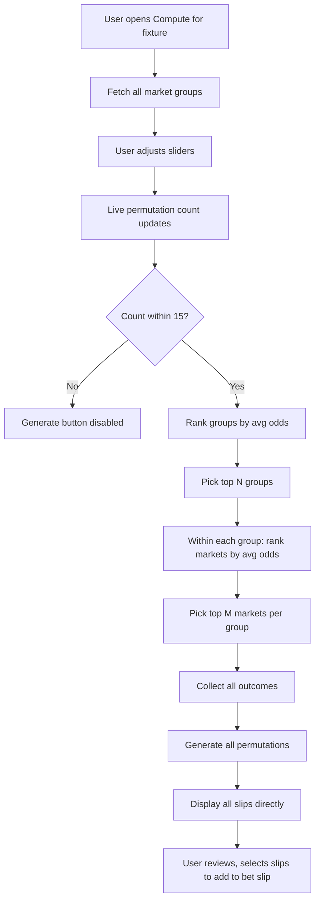

# Compute Feature — Combinatorial Bet Slip Generator

## Overview

A new feature that extracts markets from selected fixtures, pre-filters for the best-odds markets, and generates all possible permutations as bet slips using a Cartesian product of outcomes. Hard-capped at 15 total slips with user-configurable sliders.

---

## Quality Gate — MANDATORY

**Every module, component, and integration point MUST pass the following cycle before being considered complete:**

1. **First Pass — Build & Test:** Implement the feature, write unit tests, run them. Fix all failures.
2. **Second Pass — Debug & Edge-Case:** Intentionally try to break it. Test every edge case in the Edge Cases table. Add logging where needed. Fix all bugs found.
3. **Third Pass — Review & Verify:** Re-run all tests. Manually verify the UI behavior. Confirm no regressions in existing features. Fix any remaining issues.

**Minimum bugs before moving on:** 0 blocking, 0 should-fix. Only nits may be deferred.

**This cycle applies to every item in the Implementation Order below — no exceptions.**

---

## Confirmed Requirements

| Parameter               | Value                                                |
| ----------------------- | ---------------------------------------------------- |
| Groups per fixture      | User-configurable: 1–5 (default 3)                   |
| Markets per group       | User-configurable: 1–3 (default 2)                   |
| Outcomes per market     | 3 (max, from API)                                    |
| Permutation rule        | One outcome per market                               |
| Total slips hard cap    | **15** (enforced)                                    |
| Market selection metric | Highest average outcome odds                         |
| Fixture scope           | Single fixture (v1), designed for multi-fixture (v2) |

### Example Configurations Under the Cap

| Groups | Markets/Group | Total Markets | Max Outcomes Each | Total Slips |
| ------ | ------------- | ------------- | ----------------- | ----------- |
| 3      | 1             | 3             | 3                 | 27 ❌       |
| 3      | 1             | 3             | 2                 | 8 ✅        |
| 3      | 2             | 6             | 2                 | 64 ❌       |
| 2      | 2             | 4             | 2                 | 16 ❌       |
| 2      | 2             | 4             | mix 2,2,2,3       | 24 ❌       |
| 3      | 1             | 3             | mix 2,2,3         | 12 ✅       |
| 2      | 1             | 2             | 3                 | 9 ✅        |
| 1      | 2             | 2             | 3                 | 9 ✅        |

**Key insight:** With the 15-cap, practical max is ~3 markets total (not groups/markets per group). The dynamic slider constraint system enforces this automatically.

---

## Data Flow



---

## Architecture

### New Files

| File                                            | Purpose                                                       |
| ----------------------------------------------- | ------------------------------------------------------------- |
| `src/lib/compute/types.ts`                      | Compute-specific types + max permutations constant            |
| `src/lib/compute/cartesian.ts`                  | Pure permutation engine — Cartesian product                   |
| `src/lib/compute/marketFilter.ts`               | Market pre-filter — rank and select top markets by avg odds   |
| `src/hooks/useCompute.ts`                       | React hook — orchestrates the compute pipeline                |
| `src/components/compute/ComputePanel.tsx`       | Main UI panel — shows preview, controls, and results          |
| `src/components/compute/ComputeSlipPreview.tsx` | Individual slip preview row/card                              |
| `src/components/compute/ComputeControls.tsx`    | Configuration controls with live counter + slider constraints |

### Modified Files

| File                                         | Change                                        |
| -------------------------------------------- | --------------------------------------------- |
| `src/components/discovery/MarketBrowser.tsx` | Add "Compute" button to trigger the generator |
| `src/store/useSlipStore.ts`                  | Add `addMultipleSelections` batch action      |
| `src/components/layout/BetSlipDrawer.tsx`    | Support displaying compute-generated slips    |
| `src/lib/contracts/ui.contract.ts`           | Add compute-related types                     |

---

## Detailed Design

### 1. Types — `src/lib/compute/types.ts`

```typescript
import type { StakeMarket } from "@/lib/contracts/api.contract";

/** Hard cap on total permutations */
export const MAX_PERMUTATIONS = 15;

/** A market with its computed average odds */
export interface RankedMarket {
  market: StakeMarket;
  groupName: string;
  avgOdds: number; // average of all active outcome odds
  outcomeCount: number;
}

/** A group with its ranked markets */
export interface RankedGroup {
  groupName: string;
  groupTranslation: string;
  markets: RankedMarket[]; // sorted by avgOdds desc
}

/** One permutation = one bet slip */
export interface ComputeSlip {
  id: string; // deterministic hash
  selections: ComputeSelection[];
  totalCombinedOdds: number; // product of all outcome odds
}

/** A single leg in a compute slip */
export interface ComputeSelection {
  marketId: string;
  marketName: string;
  outcomeId: string;
  outcomeName: string;
  odds: number;
  groupName: string;
}

/** Compute configuration — slider values */
export interface ComputeConfig {
  groups: number; // default: 3, range: 1–5
  marketsPerGroup: number; // default: 2, range: 1–3
}

/** Compute pipeline result */
export interface ComputeResult {
  fixtureName: string;
  fixtureSlug: string;
  config: ComputeConfig;
  selectedGroups: RankedGroup[];
  totalPermutations: number;
  slips: ComputeSlip[];
}

/**
 * Dynamically computes the max allowed value for a slider
 * given current config, ensuring product never exceeds MAX_PERMUTATIONS.
 */
export function getSliderMax(
  currentGroups: number,
  currentMarketsPerGroup: number,
  adjustField: "groups" | "marketsPerGroup",
): number {
  if (adjustField === "groups") {
    if (currentMarketsPerGroup === 0) return 5;
    // groups * marketsPerGroup * 3 (worst case outcomes) <= 15
    // groups <= 15 / (marketsPerGroup * 3)
    return Math.min(5, Math.floor(MAX_PERMUTATIONS / (currentMarketsPerGroup * 3)));
  } else {
    if (currentGroups === 0) return 3;
    // groups * marketsPerGroup * 3 <= 15
    // marketsPerGroup <= 15 / (groups * 3)
    return Math.min(3, Math.floor(MAX_PERMUTATIONS / (currentGroups * 3)));
  }
}

/**
 * Compute the exact permutation count for a given config,
 * given actual market data (each market may have 2 or 3 outcomes).
 */
export function estimatePermutations(selectedMarkets: RankedMarket[][]): number {
  let total = 1;
  for (const group of selectedMarkets) {
    for (const market of group) {
      total *= market.outcomeCount;
      if (total > MAX_PERMUTATIONS) return total; // early exit
    }
  }
  return total;
}
```

### 2. Market Filter — `src/lib/compute/marketFilter.ts`

Pure functions, no side effects:

- [`rankGroupsByOdds(groups)`](src/lib/compute/marketFilter.ts) — Scores each group by the average odds across all its markets' outcomes. Returns groups sorted descending.
- [`selectTopGroups(groups, maxGroups)`](src/lib/compute/marketFilter.ts) — Takes the top N groups.
- [`rankMarketsInGroup(group, maxMarkets)`](src/lib/compute/marketFilter.ts) — Within a group, ranks markets by average outcome odds, takes top N.
- [`buildFilteredMatrix(groups, config)`](src/lib/compute/marketFilter.ts) — Returns the matrix of selected markets ready for Cartesian product.

**Ranking algorithm:**

```
avgOdds(market) = sum(outcome.odds for outcome in market.outcomes where outcome.active) / count(active outcomes)
avgOdds(group)  = sum(avgOdds(market) for market in group.markets) / count(markets in group)
```

### 3. Cartesian Product Engine — `src/lib/compute/cartesian.ts`

Pure permutation generator:

- [`generateAllPermutations(matrix)`](src/lib/compute/cartesian.ts) — Takes the market matrix, returns an array of all `ComputeSlip` objects. With the 15-cap, this is safe to materialize fully in memory.
- [`estimateTotalCount(markets)`](src/lib/compute/cartesian.ts) — Returns the total permutation count without generating them (product of outcome counts per market).

**Key design:** With max 15 slips, no need for lazy generators or pagination. All slips are generated at once and rendered directly. Each slip gets a deterministic ID based on its outcome combination.

### 4. React Hook — `src/hooks/useCompute.ts`

Orchestrates the full pipeline:

```typescript
function useCompute(fixture: DiscoveryFixture | null) {
  // State
  const [config, setConfig] = useState<ComputeConfig>({ groups: 3, marketsPerGroup: 2 });
  const [result, setResult] = useState<ComputeResult | null>(null);
  const [isLoading, setIsLoading] = useState(false);
  const [error, setError] = useState<string | null>(null);

  // Derived
  const permutationCount = useMemo(() => { /* live count */ }, [config, fixture]);
  const canGenerate = permutationCount > 0 && permutationCount <= MAX_PERMUTATIONS;

  // Actions
  const runCompute = async () => { ... };
  const addSlipToBetSlip = (slip: ComputeSlip) => { ... };
  const addSelectedSlips = (ids: string[]) => { ... };
  const addAllSlips = () => { ... };

  return { result, config, setConfig, permutationCount, canGenerate, ... };
}
```

**Flow inside `runCompute`:**

1. Fetch fixture details via [`getFixtureDetailsQuery()`](src/lib/stake-api/queries.ts) if not already loaded
2. Pass `marketGroups` through the filter pipeline
3. Build the matrix
4. Generate all permutations (max 15)
5. Store in state

### 5. UI Components

#### [`ComputePanel`](src/components/compute/ComputePanel.tsx) — Main container

- **Trigger:** Button in [`MarketBrowser`](src/components/discovery/MarketBrowser.tsx) header: "⚡ Compute"
- **Layout:** Full modal
- **Sections:**
  1. **Header** — Fixture name, tournament
  2. **Config Controls** — Groups slider (1–5), Markets per group slider (1–3), with dynamic max constraints
  3. **Live Counter** — Shows "X permutations" in real-time as sliders adjust. Red when at cap, green when under.
  4. **Matrix Preview** — Shows the selected markets with group labels and avg odds after generation
  5. **Results List** — All generated slips rendered directly (max 15 rows). Each row: slip #, outcomes, combined odds, checkbox.
  6. **Actions** — "Add Selected to Bet Slip", "Add All"

#### [`ComputeSlipPreview`](src/components/compute/ComputeSlipPreview.tsx)

Each row shows:

- Slip number
- Outcomes listed (market: outcome × odds)
- Combined odds (product)
- Checkbox for selection
- "Add" button

#### [`ComputeControls`](src/components/compute/ComputeControls.tsx)

- Groups count: slider 1–5 (default 3), max dynamically reduced by market slider
- Markets per group: slider 1–3 (default 2), max dynamically reduced by groups slider
- **Dynamic constraint logic:** When user moves one slider, the other's max adjusts to ensure `groups × marketsPerGroup × 3 ≤ 15`. Sliders cannot be dragged past the safe max.
- Real-time permutation count display

---

## Integration Points

### With Bet Slip Store

Add a batch action to [`useSlipStore`](src/store/useSlipStore.ts):

```typescript
addMultipleSelections: (selections: BetSelection[]) => void;
```

This converts each `ComputeSelection` into a `BetSelection` and adds them in batch.

### With MarketBrowser

Add a "⚡ Compute" button in the [`MarketBrowser`](src/components/discovery/MarketBrowser.tsx) header, next to "Expand All" / "Collapse All". Clicking it opens the ComputePanel modal for that fixture.

---

## Edge Cases

| Case                                      | Handling                                    |
| ----------------------------------------- | ------------------------------------------- |
| Fixture has fewer groups than configured  | Use all available groups                    |
| Group has fewer markets than configured   | Use all available markets                   |
| Market has suspended/deactivated outcomes | Exclude from permutations                   |
| No active outcomes in a market            | Skip that market, reduce matrix dimension   |
| 0 permutations possible                   | Show empty state with explanation           |
| API fetch fails                           | Show error with retry button                |
| Sliders adjusted to exceed 15             | Generate button disabled, counter turns red |

---

## Implementation Order

Each step MUST complete the 3-pass quality gate before moving to the next.

| Step | Task                                                   | Quality Gate — What to Test                                                                             |
| ---- | ------------------------------------------------------ | ------------------------------------------------------------------------------------------------------- |
| 1    | Create `src/lib/compute/types.ts`                      | Test `getSliderMax()` and `estimatePermutations()` with boundary values (0, 1, 15, 16)                  |
| 2    | Create `src/lib/compute/marketFilter.ts`               | Test ranking accuracy, top-N selection, empty groups, single-market groups, suspended outcomes excluded |
| 3    | Create `src/lib/compute/cartesian.ts`                  | Test permutation count, output correctness, edge cases (1 market, 0 outcomes, max cap)                  |
| 4    | Create `src/hooks/useCompute.ts`                       | Test state transitions, config changes trigger recompute, error handling, loading states                |
| 5    | Create `src/components/compute/ComputeControls.tsx`    | Test slider constraints enforce cap, live counter accuracy, disabled state when > 15                    |
| 6    | Create `src/components/compute/ComputeSlipPreview.tsx` | Test rendering, odds display, selection toggle, combined odds calculation                               |
| 7    | Create `src/components/compute/ComputePanel.tsx`       | Test full flow: open → config → generate → display → select → add to slip                               |
| 8    | Modify `src/components/discovery/MarketBrowser.tsx`    | Test Compute button appears, opens ComputePanel, integrates with existing UI                            |
| 9    | Modify `src/store/useSlipStore.ts`                     | Test batch add, no duplicates, state integrity after batch operations                                   |
| 10   | End-to-end integration test                            | Full flow: fixture → compute → review → add to bet slip → verify in drawer                              |

**Bug reduction target:** 0 blocking bugs, 0 should-fix bugs before feature is considered complete. Only cosmetic nits may remain.
