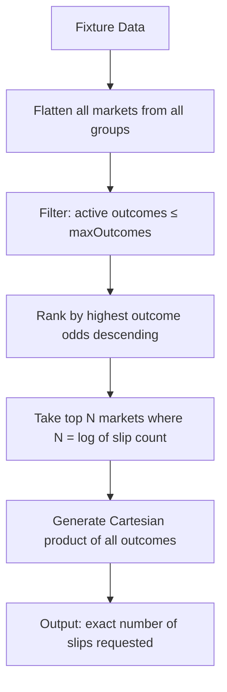
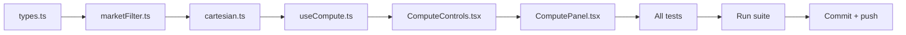

# Compute Feature Remodification Plan

## Spec Summary

Replace the current configurable compute system (two sliders, group-based filtering) with a dropdown-driven pipeline:

| Setting | Options |
|---|---|
| **Max outcomes per market** | 2 or 3 |
| **Number of slips** | Depends on max outcomes (see below) |
| **Market selection** | Always top N by highest odds |
| **Output** | Full Cartesian product |

### Permutation Table

| Max Outcomes | Slips | Markets Needed | Formula |
|---|---|---|---|
| 2 | 16 | 4 | 2⁴ |
| 2 | 32 | 5 | 2⁵ |
| 2 | 64 | 6 | 2⁶ |
| 3 | 27 | 3 | 3³ |
| 3 | 81 | 4 | 3⁴ |

**Rule:** Always select the combinations that have the highest odds.

## UI Design

Two dropdowns replacing the current sliders:

```
┌─────────────────────────────────────┐
│ Configuration                       │
│                                     │
│  Outcomes / Market    [▼ 2        ] │
│  Number of Slips      [▼ 16       ] │
│                                     │
│  Permutations: 16                   │
│  Markets needed: 4                  │
│                                     │
│  [ Generate ]                       │
└─────────────────────────────────────┘
```

- When "Outcomes / Market" changes, "Number of Slips" resets to the first valid option
- "Number of Slips" dropdown options change dynamically based on outcomes selection
- Permutation count and markets needed shown as derived info

## Data Flow



## File-by-File Changes

### 1. `src/lib/compute/types.ts`

**Remove:**
- `getSliderMax()` function (no more dynamic slider constraints)
- `RankedGroup` interface (no more group-based structure)

**Modify:**
- `MAX_PERMUTATIONS`: 15 → 81 (new ceiling)
- `ComputeConfig`: replace `{ groups, marketsPerGroup }` with `{ maxOutcomes: 2 | 3, slipCount: number }`
- `ComputeSelection`: remove `groupName` field
- `ComputeResult`: remove `config` and `selectedGroups`, add `selectedMarkets: RankedMarket[]`

**Add:**
- `SLIP_OPTIONS` constant map: `{ 2: [16, 32, 64], 3: [27, 81] }`
- `marketsNeeded(slipCount, maxOutcomes): number` — computes `log(maxOutcomes, slipCount)`, i.e. the number of markets required
- `estimatePermutations()` simplified: returns the selected `slipCount` directly (it's deterministic given the config)

### 2. `src/lib/compute/marketFilter.ts`

**Remove:**
- `rankGroupsByOdds()` — no longer grouping by sport groups
- `selectTopGroups()` — no group selection
- `rankMarketsInGroup()` — no per-group market selection
- `buildFilteredMatrix()` — no 2D matrix

**Add:**
- `flattenAllMarkets(groups: StakeGroupWithMarkets[]): StakeMarket[]` — flattens all markets from all groups/templates into a single array
- `filterByOutcomeCount(markets: StakeMarket[], maxOutcomes: number): RankedMarket[]` — keeps only markets with `active outcomes ≤ maxOutcomes`, ranks by highest outcome odds descending
- `selectTopMarkets(groups: StakeGroupWithMarkets[], config: ComputeConfig): RankedMarket[]` — orchestrates: flatten → filter → rank → take top N (where N = `marketsNeeded`); throws if < N qualifying markets

### 3. `src/lib/compute/cartesian.ts`

**Simplify:**
- `estimateTotalCount()`: given `markets × outcomes` count
- `generateAllPermutations()`: same Cartesian product logic but operates on a flat `RankedMarket[]` (not 2D matrix). No group indexing needed.

### 4. `src/hooks/useCompute.ts`

**Remove:**
- `DEFAULT_CONFIG` constant (replaced with `{ maxOutcomes: 2, slipCount: 16 }`)
- `configRef` and clamping `useEffect` (no more slider desync issues)
- `actualMaxOutcomes` derived state
- `buildFilteredMatrix` import
- `selectTopGroups` / `rankMarketsInGroup` imports

**Simplify:**
- `UseComputeReturn`: keep `config`/`setConfig` (but config is now dropdown-driven), remove `actualMaxOutcomes`, `dataLoaded`. Add `availableSlipCounts: number[]` (dynamic based on `config.maxOutcomes`).
- Auto-fetch effect stays (fetches fixture details on fixture change)
- `permutationCount` = `config.slipCount` if enough qualifying markets exist, else 0
- `marketsNeeded` = derived from config
- `canGenerate` = enough qualifying markets exist
- `runCompute()` calls `selectTopMarkets()` → `generateAllPermutations(flatArray)`

**Keep:**
- `computeSlipToBetSelections()` — unchanged
- `addSlipToBetSlip`, `addSelectedSlips`, `addAllSlips` — unchanged
- `retry`, `clearError` — unchanged

### 5. `src/components/compute/ComputeControls.tsx`

**Rewrite:**
- Remove Radix Slider entirely
- Add two `<Select>` dropdowns:
  1. "Outcomes / Market" — options: 2, 3
  2. "Number of Slips" — options dynamic based on outcomes selection
- Show derived info: "Markets needed: N", "Permutations: X"
- Show error if insufficient qualifying markets
- Keep Generate button

### 6. `src/components/compute/ComputePanel.tsx`

**Modify:**
- Remove `actualMaxOutcomes`, `dataLoaded` from hook destructuring
- Add `availableSlipCounts` to destructuring
- Pass `availableSlipCounts` to controls
- "Selected Markets" section shows the N ranked binary markets (available before generation)
- Update `MAX_DISPLAY_SLIPS` to 81
- Remove old "Configuration" heading, replace with new controls

### 7. `src/components/compute/ComputeSlipPreview.tsx`

**No changes needed** — already displays `slip.selections` generically.

### 8. Tests

| Test file | Change |
|---|---|
| `types.test.ts` | Remove `getSliderMax` tests, update `MAX_PERMUTATIONS` to 81, add `marketsNeeded` tests, update `estimatePermutations` |
| `marketFilter.test.ts` | Replace group-based tests with flatten + filter + rank + select tests |
| `cartesian.test.ts` | Update matrix input from 2D to flat array |
| `useCompute.test.ts` | Remove config/slider tests, remove clamping tests, add dropdown-driven config tests |
| `ComputeControls.test.tsx` | Replace slider tests with dropdown tests |
| `ComputePanel.test.tsx` | Update props, remove slider mocks |
| `ComputeSlipPreview.test.tsx` | No changes expected |
| `compute-flow.test.ts` | Update integration flow for new pipeline |

## Execution Order



## Edge Cases to Handle

- **Fewer qualifying markets than needed**: Show error, disable Generate
- **Market with 0 active outcomes**: Already filtered out
- **Market with 1 active outcome**: Valid for maxOutcomes=2 or 3 (contributes ×1 to permutations)
- **User switches from 3-outcomes to 2-outcomes**: Reset slipCount to first valid option (16)
- **No markets at all**: Error state, no generation possible
