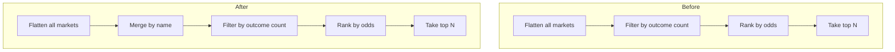
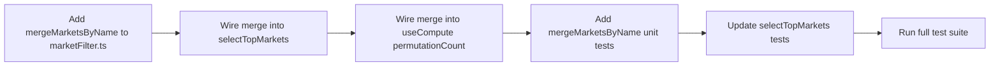

# Market Classification Modification

## Problem

Markets with the same heading (e.g. "2nd Half -Ado '20 Total") arrive from the Stake API as separate `StakeMarket` objects — one per line (Over/Under 0.5, Over/Under 1.5, Over/Under 2.5). The current compute pipeline treats each as an independent market. Since each has only 2 active outcomes, all 3 pass the `≤ maxOutcomes` filter and are selected as separate markets in the Cartesian product.

**Desired behavior**: Markets sharing the same `name` should be merged into a single logical market. The merged market's total outcome count determines whether it qualifies. In the example, 3 pairs × 2 outcomes = 6 outcomes — this exceeds `maxOutcomes` (2 or 3), so the merged market is excluded from compute.

## Solution

Insert a **merge-by-name** step into the market filter pipeline, between flattening and filtering. Markets with unique names pass through unchanged. Markets sharing a name are combined into a single synthetic `StakeMarket` whose outcomes are the union of all originals.

### Data Flow — Before vs After



### Merge Algorithm

```
Input:  StakeMarket[]  (all flattened markets)
Output: StakeMarket[]  (markets with unique names)

1. Group markets by `market.name`
2. For each group:
   - If group has 1 market → pass through unchanged
   - If group has N > 1 markets → create synthetic StakeMarket:
       id:       group[0].id           (first market's ID)
       name:     group key              (the shared heading)
       status:   "active"
       extId:    group[0].extId
       provider: group[0].provider
       outcomes: group.flatMap(m → m.outcomes)   (union of all outcomes)
3. Return the consolidated array
```

### Qualification Impact

| Scenario                                                           | Before                          | After                                          |
| ------------------------------------------------------------------ | ------------------------------- | ---------------------------------------------- |
| 3 markets named "2nd Half Total", each with 2 outcomes             | 3 qualifying markets (each ≤ 2) | 1 merged market with 6 outcomes → **excluded** |
| 1 market "Match Winner" with 3 outcomes, maxOutcomes=3             | 1 qualifying market             | 1 qualifying market (unchanged)                |
| 2 markets named "Total Goals", each with 2 outcomes, maxOutcomes=2 | 2 qualifying markets            | 1 merged market with 4 outcomes → **excluded** |

## File Changes

### 1. `src/lib/compute/marketFilter.ts`

**Add** `mergeMarketsByName(markets: StakeMarket[]): StakeMarket[]`

- Groups markets by `market.name` using a `Map`
- Single-market groups pass through unchanged
- Multi-market groups produce one synthetic `StakeMarket` with merged outcomes

**Modify** `selectTopMarkets()` — insert merge step:

```typescript
export function selectTopMarkets(
  groups: StakeGroupWithMarkets[],
  config: ComputeConfig,
): RankedMarket[] {
  const allMarkets = flattenAllMarkets(groups);
  const merged = mergeMarketsByName(allMarkets); // ← NEW
  const ranked = filterByOutcomeCount(merged, config.maxOutcomes);
  // ... rest unchanged
}
```

### 2. `src/hooks/useCompute.ts`

**Modify** `permutationCount` useMemo — insert merge step:

```typescript
const permutationCount = useMemo(() => {
  if (marketGroups.length === 0) return 0;
  const needed = marketsNeeded(config.slipCount, config.maxOutcomes);
  const allMarkets = flattenAllMarkets(marketGroups);
  const merged = mergeMarketsByName(allMarkets); // ← NEW
  const qualifying = filterByOutcomeCount(merged, config.maxOutcomes);
  if (qualifying.length < needed) return 0;
  const topN = qualifying.slice(0, needed);
  return topN.reduce((acc, m) => acc * m.outcomeCount, 1);
}, [config, marketGroups]);
```

Import `mergeMarketsByName` from `marketFilter.ts`.

### 3. `tests/unit/compute/marketFilter.test.ts`

**Add** new `describe("mergeMarketsByName")` block with tests:

- Returns empty array for empty input
- Passes through markets with unique names unchanged
- Merges two markets with the same name into one with combined outcomes
- Merges three markets with the same name
- Keeps different-named markets separate while merging same-named ones
- Preserves first market's id, extId, provider on the merged result
- Handles mix of unique and duplicate names

**Update** `selectTopMarkets` tests:

- Add test: markets with same name but exceeding maxOutcomes are excluded
- Existing tests still pass (they use unique names)

### 4. No changes needed

| File                                                    | Reason                                                                       |
| ------------------------------------------------------- | ---------------------------------------------------------------------------- |
| `src/lib/compute/types.ts`                              | `RankedMarket` and `ComputeSelection` are generic — work with merged markets |
| `src/lib/compute/cartesian.ts`                          | Operates on `RankedMarket[]` — already correct                               |
| `src/hooks/useCompute.ts` (other than permutationCount) | `runCompute()` calls `selectTopMarkets()` which handles the merge            |
| `src/components/compute/*`                              | UI is driven by `ComputeResult` — no awareness of merge logic                |
| `src/store/useSlipStore.ts`                             | Store is unaffected                                                          |

## Edge Cases

- **Market name with leading/trailing whitespace**: Use trimmed name for grouping but preserve original name on the synthetic market
- **All markets have unique names**: Merge step is a no-op (O(n) pass, no allocations beyond the Map)
- **Market with 0 active outcomes**: Already filtered out by `filterByOutcomeCount` after merge — no special handling needed
- **Single-market group**: Passed through unchanged, preserving original id/extId/provider

## Execution Order


